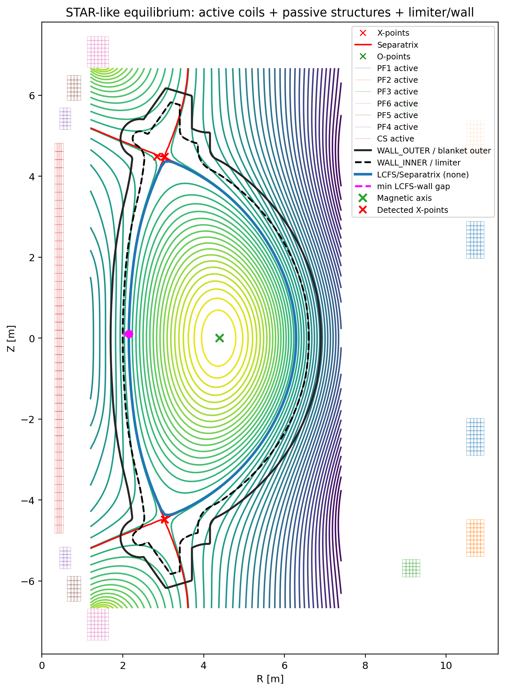
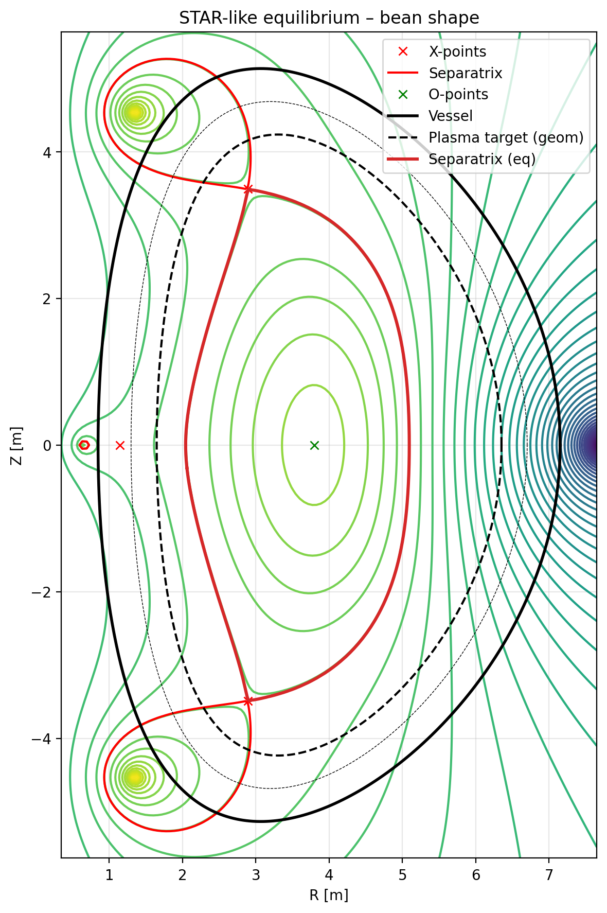
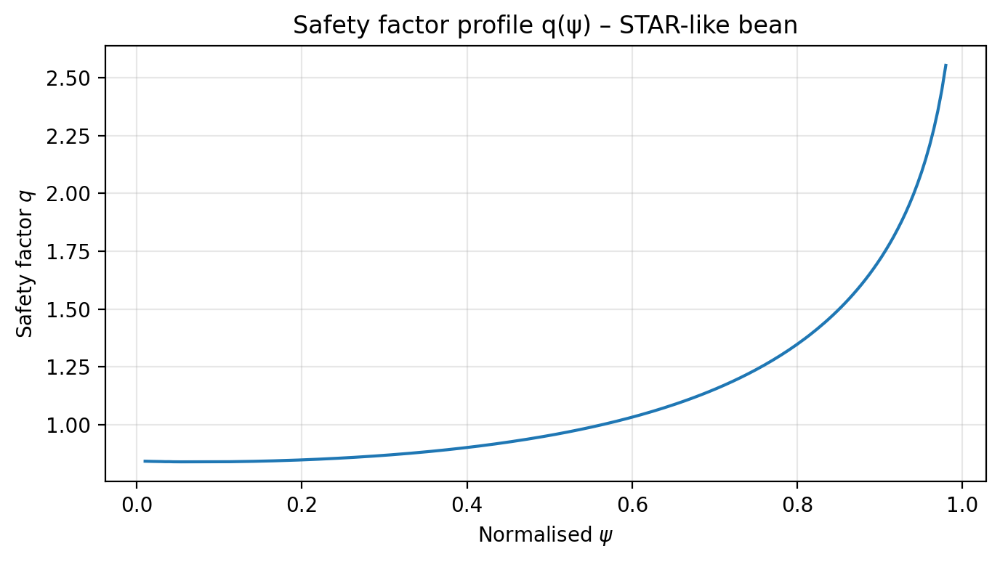
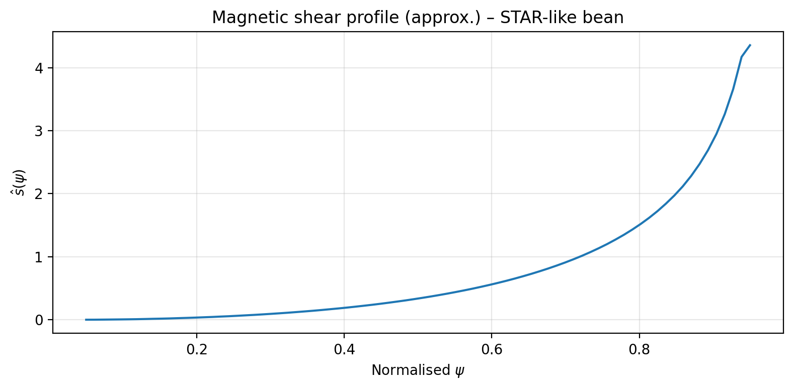
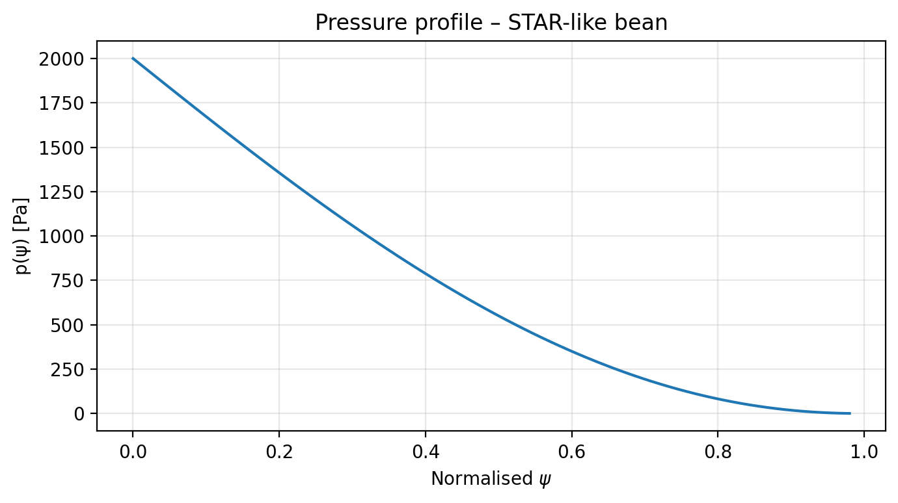
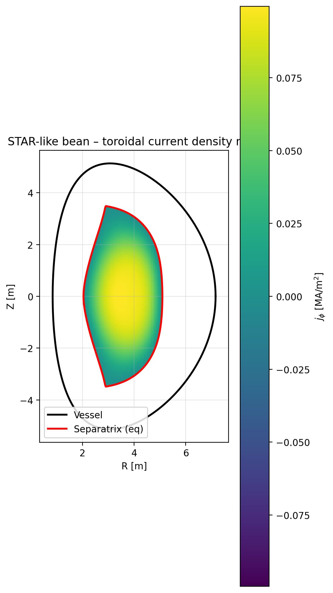

# STAR-like Tokamak Equilibrium — FreeGSNKE Grad–Shafranov Workflow


> From scratch `FreeGSNKE` setup to design, solve and diagnose a **bean-shaped, STAR-like spherical tokamak equilibrium**: geometry, coil system, current scans, Grad–Shafranov solution, and MHD diagnostics.

---

## Overview

This repository implements a complete **equilibrium design pipeline** for a compact, spherical tokamak inspired by the **STAR** reactor concept, using the **FreeGSNKE** Grad–Shafranov solver.

Starting from a **Miller-type target boundary** (major radius, aspect ratio, elongation, triangularity), the code:

- Builds a **new machine**: inner/outer walls, PF coils, central solenoid (CS), and target boundary.
- Runs **current scans** in the PF/CS parameter space to search for strongly shaped equilibria.
- Identifies a **bean-shaped spherical tokamak equilibrium** with low aspect ratio, high elongation, and strong positive triangularity.
- Computes **MHD diagnostics**:
  - separatrix geometry (A, kappa, delta),
  - safety factor profile `q(ψ)`,
  - pressure profile and poloidal beta,
  - toroidal current density map,
  - approximate magnetic shear profile,
  - global numbers in a compact text file.
- Optionally generates a **quasi-static ramp-up animation** from a weakly shaped state to the final bean-shaped equilibrium.

The project is intentionally **minimal but research-oriented**: all physics is handled by `FreeGSNKE`, while the Python layer focuses on **geometry-building, scans and diagnostics**.

---

## Physics Background

### Spherical tokamaks and STAR-like shaping

A **spherical tokamak** is a low–aspect–ratio device (`A = R0 / a ~ 1.3–2`) where the the plasma cross-section is highly shaped:

- **Aspect ratio** `A = R0 / a`  
  (R0: major radius, a: minor radius).
- **Elongation** `κ ≈ (Z_top − Z_bottom) / (2a)`  
  controls vertical stretching of the plasma column.
- **Triangularity** `δ ≈ (R_X − R0) / a`  
  measures the horizontal shift of the upper/lower “corners” of the cross-section.

The STAR concept belongs to the class of **advanced spherical tokamak reactors**: compact, very shaped plasmas, with strong vacuum field and substantial plasma pressure. This repo builds a **STAR-like** equilibrium in that spirit: low aspect ratio, high elongation, **strong positive triangularity** (bean-shaped cross-section).

### Grad–Shafranov equation (axisymmetric MHD equilibrium)

Assuming static single-fluid MHD and toroidal symmetry (∂/∂φ = 0), the magnetic field is written in terms of a poloidal flux function ψ(R, Z) and a toroidal field function F(ψ):

- `B = (1/R) ∇ψ × φ̂ + [F(ψ)/R] φ̂`
- pressure and toroidal field are flux functions: `p = p(ψ)`, `F = F(ψ)`.

Combining **force balance** `∇p = j × B` with Ampère’s law yields the **Grad–Shafranov equation**:

```math
Δ* ψ = - μ₀ R² dp/dψ - ½ dF²/dψ
```

with the Grad–Shafranov operator:

```math
Δ* ψ = R ∂/∂R ( (1/R) ∂ψ/∂R ) + ∂²ψ/∂Z² .
```

Given:
- the **vessel & conductor geometry** (walls + coils),
- the profiles `p(ψ)` and `F(ψ)`,  

the task is to find ψ(R, Z) satisfying this equation and appropriate boundary conditions on the outer wall. All of that is handled by **FreeGSNKE**; this repo wraps it into a coherent STAR-like workflow.

---

## Project Layout

```text
STAR-like-tokamak-equilibrium/
├─ pyscripts/
│  ├─ star_machine.py          # Build STAR-like geometry & Machine (walls, coils, target boundary)
│  ├─ config_star_bean.py      # Central configuration (R0, A, κ, δ, Ip, p_axis, coil currents, etc.)
│  ├─ star_equilibrium.py      # Build and solve reference STAR-like bean equilibrium + basic plots
│  ├─ scan_star_shape.py       # PF/CS current scan + local micro-scan with misfit and timeouts
│  ├─ diagnostics_star_bean.py # q(ψ), pressure, shear, j_φ map, global numbers
│  ├─ animate_star_bean.py     # Quasi-static ramp-up animation from weak to strong shaping
│  └─ utils.py                 # Environment bootstrap, common utilities, paths
│
├─ results/
│  ├─ STAR_bean_equilibrium.png       # Flux map of final bean-shaped equilibrium
│  ├─ STAR_bean_shape.png             # Target boundary vs separatrix
│  ├─ STAR_bean_q_profile.png         # q(ψ̄) profile
│  ├─ STAR_bean_pressure.png          # p(ψ̄) profile
│  ├─ STAR_bean_shear_profile.png     # Approximate magnetic shear
│  ├─ STAR_bean_jtor_map.png          # Toroidal current density map j_φ(R,Z)
│  ├─ STAR_bean_global_numbers.txt    # Compact text summary of key parameters
│  └─ star_bean_ramp_refined.mp4      # Ramp-up animation (optional)
│
├─ report.tex            # Full LaTeX report with equations & detailed derivations
└─ README.md             # This file
```

---

## Dependencies & Environment

- **Python** ≥ 3.10
- **FreeGSNKE** (installed in your Python environment; this project assumes you can `import freegsnke`)
- Python libraries (installed automatically by `utils.py`):
  - `numpy`
  - `matplotlib`
  - `tqdm`
  - `rich`
  - plus whatever `FreeGSNKE` itself needs

### One-time setup

From the repo root:

```bash
# Option 1: use the bootstrap helper (recommended)
python pyscripts/utils.py --bootstrap
```

This will:

- create a local virtual environment (e.g., `.venv/`),
- install required Python packages into it,
- tell you how to activate it on your platform.

Alternatively, you can manage the environment yourself and install dependencies manually.

---

## Typical Workflow

The repository is organized around a **single reference case**: the **STAR-like bean equilibrium**. A typical workflow is:

1. **Build the machine geometry** (walls + coils + target boundary).
2. **Run current scans** in PF/CS space to find good shaping.
3. **Solve the final equilibrium** at higher resolution.
4. **Run diagnostics** to extract geometry and MHD profiles.
5. **Optionally generate an animation** of a quasi-static ramp-up.

Assuming your environment is ready and you are in the repo root:

```bash
# (optional) rebuild or inspect the STAR-like machine
python pyscripts/star_machine.py      # if it offers a main() / demo plotting

# 1) Run PF/CS current scan + micro-scan (coarse equilibria with misfit function)
python pyscripts/scan_star_shape.py

# 2) Build the final high-resolution bean-shaped equilibrium and flux map
python pyscripts/star_equilibrium.py

# 3) Run MHD diagnostics for the bean-shaped case
python pyscripts/diagnostics_star_bean.py

# 4) Generate ramp-up animation (saved as results/star_bean_ramp_refined.mp4)
python pyscripts/animate_star_bean.py
```

> **Note:** The scripts are written to be self-contained. If in doubt, run  
> `python pyscripts/<script>.py --help` to see if there are command-line options,  
> or simply run them from the repo root; outputs are written into `results/`.

---

## What Each Script Does

### `star_machine.py` — STAR-like geometry & coil system

- Builds a **Miller-type target boundary** with prescribed:
  - `R0_geom` (target major radius),
  - `A_geom` (target aspect ratio),
  - `κ_geom` (target elongation),
  - `δ_geom` (target triangularity).
- Constructs **inner and outer walls** by expanding the target boundary with radial/vertical gaps.
- Defines a **poloidal field coil set**:
  - **CS** (central solenoid),
  - **PF1U/L** (coarse vertical control, on the low-field side),
  - **PF2U/L** (top and bottom shaping),
  - **PF3U/L** (triangularity / bean shaping on the high-field side).
- Wraps everything into a `FreeGSNKE` `Machine` object with labelled coils and circuits.

The resulting machine is analogous to built-in machines (e.g. TCV, MAST-U) but tailored to a STAR-like spherical tokamak.

---

### `config_star_bean.py` — Central configuration

Holds the **canonical parameters** for the reference bean-shaped scenario, e.g.:

- geometric targets (`R0`, `A`, `κ`, `δ`),
- plasma parameters (`Ip`, `p_axis`, `f_vac`),
- fiducial PF/CS currents,
- grid resolution for coarse scans vs high-resolution runs.

Keeping configuration in a single module makes it easy to:

- create **variants** (e.g. different Ip or β),
- run **parameter scans** by importing and modifying config values.

---

### `scan_star_shape.py` — PF/CS current scan & micro-scan

Implements a **two-stage search** in PF/CS current space:

1. **Global-ish scan** with a coarse grid in currents:

   - For each combination `(I_CS, I_PF1, I_PF2, I_PF3)`:
     - build machine + equilibrium on a coarse rectangular grid,
     - call `shape_from_separatrix` to extract:
       - `R0_plasma, a_plasma, A_plasma, κ_plasma, δ_u, δ_l`,
     - compute a **misfit** that penalizes:
       - wrong major radius (`R_ax` vs target),
       - deviation of κ from a target,
       - triangularity far from a desired range,
       - negative triangularity, overly thin plasmas, and large radial shifts.

   - Each equilibrium is solved in a **separate subprocess** with a **hard timeout**, so non-convergent cases are automatically discarded.

2. **Local micro-scan** around the best candidate:

   - refine PF currents (typically PF1 and PF3) with finer steps,
   - retune misfit to push towards:
     - **high elongation** (κ ≳ 2),
     - **strong positive triangularity** (δ ~ 0.3–0.7),
     - reasonable major radius.

The final outcome of the micro-scan is a set of PF/CS currents that,
when used in a higher-resolution run, generate the bean-shaped
equilibrium analysed in the next sections. A representative set of
per-coil currents is:

```text
I_CS       ≈ 0.8 MA
I_PF1U/L   ≈ -0.20 MA
I_PF2U/L   ≈  0    MA
I_PF3U/L   ≈ +1.0  MA
```

---

### `star_equilibrium.py` — High-resolution bean-shaped equilibrium

Once a good PF/CS configuration is known, this script:

- builds the STAR-like machine with those fixed currents,
- defines **plasma profiles** via `ConstrainPaxisIp`:
  - on-axis pressure `p_axis ≈ 2 kPa`,
  - total plasma current `Ip ≈ 0.8 MA`,
  - vacuum field parameter `f_vac ≈ 0.5 T·m`,
  - shape exponents (α_m, α_n) for smooth p(ψ) and F(ψ),
- solves the **Grad–Shafranov equation** with `GSstaticsolver.NKGSsolver` on a finer grid,
- saves a **flux map** and basic outputs in `results/`, notably:

  - `results/STAR_bean_equilibrium.png` — poloidal flux, coils, target boundary, separatrix,
  - possibly a serialized equilibrium object or auxiliary arrays used later by diagnostics.

This is your **reference bean-shaped STAR-like equilibrium**.

---

### `diagnostics_star_bean.py` — Geometry & MHD profiles

This script computes and plots a set of **diagnostics** for the bean equilibrium:

- **Separatrix geometry** via `shape_from_separatrix`:
  - R₀_plasma, a_plasma, A_plasma,
  - κ_plasma, δ_u, δ_l,
  - Shafranov shift (R_ax − R₀_plasma).

- **Safety factor profile**:
  - samples `q(ψ̄)` using `eq.q(psinorm)` for ψ̄ ∈ [0, 1],
  - writes `results/STAR_bean_q_profile.png`.

- **Pressure profile and β_p**:
  - samples p(ψ̄) from the constrained profiles,
  - retrieves `β_p` (poloidal beta) from `eq.poloidalBeta1()`,
  - writes `results/STAR_bean_pressure.png`.

- **Toroidal current density map**:
  - computes j_φ(R, Z) inside the separatrix,
  - writes `results/STAR_bean_jtor_map.png`.

- **Approximate magnetic shear**:
  - computes `ŝ(ψ̄) ≈ (ψ̄/q) dq/dψ̄` via finite differences,
  - writes `results/STAR_bean_shear_profile.png`.

- **Global summary file**:
  - packs the most relevant numbers into
    `results/STAR_bean_global_numbers.txt`
    (A, κ, δ, β_p, q_95, Shafranov shift, etc.).

This script is where you “turn an equilibrium into physics”: geometry, q-profile, pressure, and basic stability indicators.

---

### `animate_star_bean.py` — Ramp-up animation

Generates a **quasi-static ramp-up** in which:

- PF/CS currents and plasma parameters are scaled by a factor `f ∈ [f_start, f_end]`,
- at each step:
  - currents and profiles are updated,
  - the Grad–Shafranov problem is resolved using the previous ψ as an initial guess (quasi-static sequence),
  - the flux surfaces and separatrix are plotted.

Outputs:

- `results/star_bean_ramp_refined.mp4` — a short MP4 showing the plasma evolving from a weakly shaped state to the final bean-shaped configuration.

This is particularly useful for presentations and to build intuition about how **shaping evolves** as currents ramp up.

---

## Example Results

All images below live in `results/` and are generated by the scripts in `pyscripts/`.

### 1) Bean-shaped STAR-like equilibrium (flux map)



- Strong shaping on the low-field side.
- Two well-defined X-points.
- Plasma fully contained within the vessel volume.

### 2) Separatrix geometry vs target boundary



- Comparison between **Miller target boundary** and the **actual separatrix** from the Grad–Shafranov solution.
- Typical geometry for the final bean-shaped case:
  - `A_plasma ≈ 1.4` (low aspect ratio),
  - `κ_plasma ≈ 2.2` (high elongation),
  - `δ_u ≈ δ_l ≈ 0.7` (strong positive triangularity).

### 3) Safety factor and shear

  


- q-profile:
  - `q_min ≈ 1` in the core,  
  - `q_95 ~ 2.4`, monotonic increase.
- Shear profile:
  - low shear near the centre,
  - stronger shear towards the edge.  
  This is consistent with many spherical tokamak scenarios.

### 4) Pressure and current density

  


- Pressure:
  - smooth, monotonic p(ψ̄), with on-axis p ~ 2 kPa,
  - poloidal beta `β_p ~ 0.4`: low-to-moderate beta, sufficient to produce a noticeable Shafranov shift.
- j_φ(R, Z):
  - elongated current channel,
  - peak j_φ of order 10⁵ A/m² (order-of-magnitude).

---

## Interpreting the Diagnostics

A few qualitative takeaways for this reference case:

- **Geometry**
  - The equilibrium achieves a **STAR-like spherical tokamak**:
    - low aspect ratio (`A ≈ 1.4`),
    - high elongation (`κ ≳ 2`),
    - strong triangularity (`δ ≈ 0.7`).
  - The **Shafranov shift** is sizeable (`ΔR ~ 0.4 a`), as expected for finite-β, low-A plasmas.

- **Safety factor**
  - `q₀ ≈ 1` suggests potential susceptibility to **internal kinks / sawteeth** under strong heating.
  - No reversed shear; `q` increases smoothly to `q_95 ~ 2.4`, consistent with simple spherical tokamak regimes.

- **Pressure and β**
  - `β_p` around 0.4 is moderate: enough to shape the plasma and shift the axis, but below extreme reactor-grade high-β scenarios.
  - This makes the equilibrium numerically robust and convenient as a **baseline design point**.

- **Current density & coils**
  - Current density structure is aligned with the shaped plasma cross-section.
  - Largest electromagnetic loads are expected on **CS** and **PF3** coils; exact numbers depend on the FreeGSNKE force routines and are mainly a **first mechanical estimate**, not a detailed structural analysis.

---

## Limitations & Assumptions

- **Axisymmetry:** strictly ∂/∂φ = 0 equilibria; no 3D effects.
- **Single-fluid MHD:** no two-fluid or kinetic corrections in the equilibrium.
- **Equilibrium only:** stability and transport are not analysed here (but can be added on top using other tools).
- **Simplified coil models:** coils are represented as idealized rectangular blocks; detailed engineering design is out of scope.
- **Moderate β regime:** although shaping is strong, the pressure level is modest compared to full reactor scenarios.

Despite these simplifications, the workflow is representative enough to:

- explore **shaping strategies** for spherical tokamaks,
- generate realistic equilibria for **further MHD and transport studies**,
- serve as a **pedagogical example** of building a machine in FreeGSNKE from scratch.

---

## Ideas for Future Extensions

- Add extra PF families (PF4, PF5) and extend the misfit to **jointly optimise** `(A, κ, δ, R0)` and possibly q-profile targets.
- Implement **divertor configurations** (explicit X-points) and test compatibility with realistic divertor geometries.
- Increase `Ip`, `p_axis` and `B0` to probe **high-β STAR-like scenarios**, monitoring convergence and stability indicators.
- Export equilibria to standard formats (e.g. GEQDSK) to feed into other MHD / transport codes.

---

## References

- J. P. Freidberg, *Ideal Magnetohydrodynamics*, Cambridge University Press (2014).  
- F. F. Chen, *Introduction to Plasma Physics and Controlled Fusion*, Springer (2016).  
- Standard references and documentation for **FreeGSNKE** and Grad–Shafranov solvers  
  (see the official FreeGSNKE repository and docs).

---

## Contact

- **Author:** Juan Pablo Solís Ruiz  
- **Email:** jp.sruiz18.tec@gmail.com  
- **GitHub:** [h4xter1612](https://github.com/h4xter1612)

If you use or adapt this workflow for your own experiments or publications, a citation or a short acknowledgement is highly appreciated.

